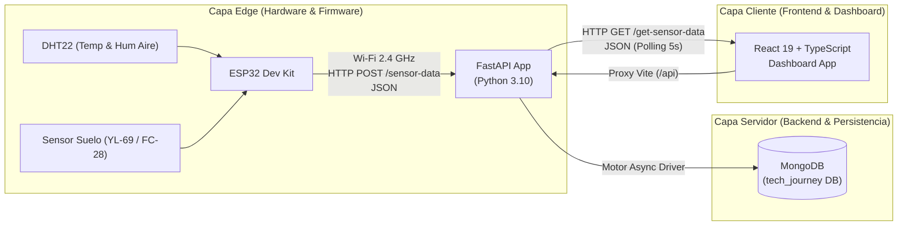
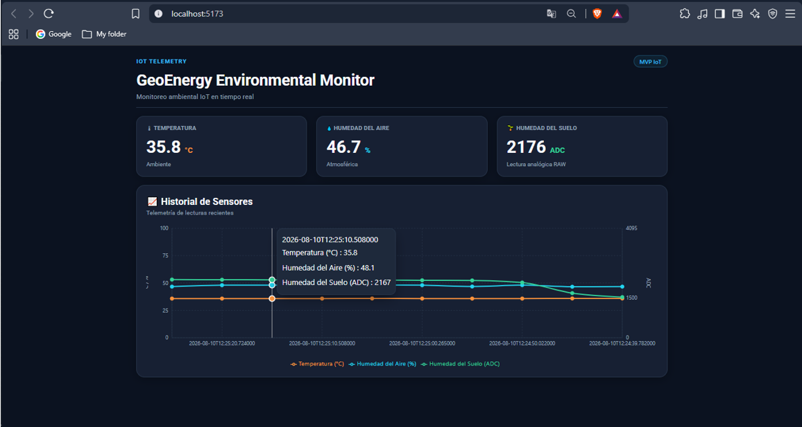
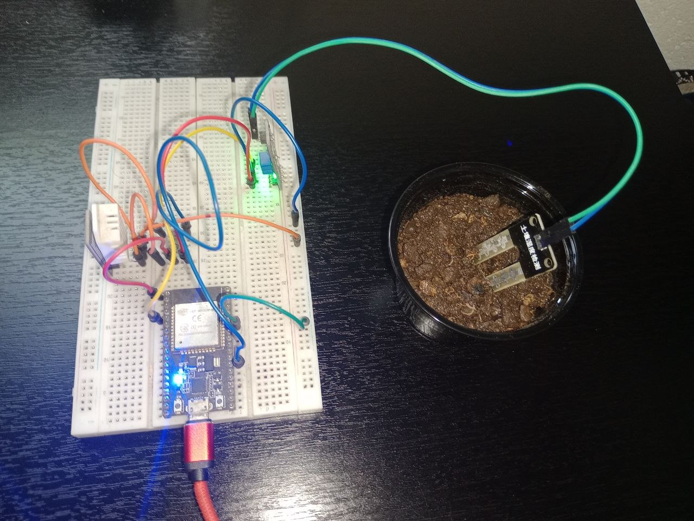

# GeoEnergy Environmental Monitor

**MVP IoT full-stack para telemetría ambiental aplicada a escenarios de energía renovable y contexto geotérmico.**

> **Nota sobre el estado del proyecto:** Este repositorio representa un **MVP / Proof of Concept (PoC)** funcional diseñado para demostrar la integración vertical de tecnologías IoT (Hardware, Firmware, Backend y Frontend). No es un sistema industrial SCADA, plataforma OT ni solución production-ready.

---

## 📋 Resumen

**GeoEnergy Environmental Monitor** es una plataforma de telemetría ambiental end-to-end que adquiere variables de temperatura, humedad del aire y humedad del suelo mediante microcontroladores ESP32 en campo, transmite las lecturas a través de Wi-Fi hacia una API REST en FastAPI, las persiste en una base de datos NoSQL MongoDB y las visualiza en tiempo real en un Dashboard web interactivo desarrollado con React y TypeScript.

Está concebido como una demostración técnica de portafolio para aplicaciones de monitoreo distribuido e instrumentación en entornos de energía renovable y recursos geotérmicos.

---

## 📐 Arquitectura del Sistema

El siguiente diagrama ilustra la arquitectura de componentes y el flujo de datos desde los sensores físicos en la capa Edge hasta la interfaz del usuario:



---

## 🛠️ Stack Tecnológico

### Firmware / Edge
- **Microcontrolador:** ESP32 Dev Module
- **Lenguaje / Entorno:** C++ / Arduino Framework
- **Sensores:** DHT22 (Temperatura y Humedad de Aire), Sensor de Humedad de Suelo Higrómetro analógico/digital
- **Librerías Clave:** `WiFi.h`, `HTTPClient.h`, `ArduinoJson`, `Adafruit_Sensor`, `DHT`

### Backend
- **Lenguaje:** Python 3.10+
- **Framework Web:** FastAPI `0.115.8`
- **Validación / Esquemas:** Pydantic `2.10.6` / Pydantic Settings `2.7.1`
- **Driver Asíncrono DB:** Motor `3.7.0` (PyMongo `4.11.1`)
- **Servidor ASGI:** Uvicorn `0.34.0`
- **Base de Datos:** MongoDB local (`localhost:27017`)

### Frontend
- **Framework UI:** React `19.0.0`
- **Lenguaje:** TypeScript `5.7.2`
- **Herramienta de Build:** Vite `6.1.0`
- **Componentes & Estilos:** Material UI (MUI `6.4.4`) / Emotion
- **Gráficas:** Recharts `2.15.1`
- **Animaciones & PWA:** Framer Motion `12.4.2` / Vite PWA `1.0.2`
- **Cliente HTTP:** Axios `1.7.9`

---

## 🔌 Hardware y Pinout

La integración física de sensores con el microcontrolador ESP32 utiliza las siguientes asignaciones GPIO:

| Sensor / Periférico | Pin del Sensor | Pin GPIO ESP32 | Modo de Entrada | Tipo de Lectura |
| :--- | :--- | :--- | :--- | :--- |
| **DHT22** | DATA | `GPIO 4` | Digital Input | Temperatura (°C) y Humedad Aire (%) |
| **Higrómetro Suelo** | AO (Analog Out) | `GPIO 34` | Analog Input (ADC1_CH6) | Lectura ADC bruta (0 - 4095) |
| **Higrómetro Suelo** | DO (Digital Out) | `GPIO 27` | Digital Input | Flag binario (HIGH = Seco, LOW = Húmedo) |

> **Aclaración sobre Lecturas de Suelo:** En la versión actual del MVP, el valor de `humedad_suelo` se transmite y presenta como una lectura ADC bruta (0 a 4095) sin calibración previa a porcentaje volumétrico.

---

## 🔄 Contrato de Datos End-to-End

### 1. Payload de Ingesta (ESP32 ➔ Backend)
Endpoint: `POST /sensor-data`<br>
Frecuencia de muestreo: Cada 5000 ms (5 segundos).

```json
{
  "temperatura": 25.4,
  "humedad_aire": 62.1,
  "humedad_suelo": 2150,
  "suelo_seco": 0
}
```

*Nota sobre el esquema actual:* El firmware transmite el parámetro `suelo_seco` (0 ó 1); sin embargo, en la versión actual del modelo Pydantic en backend (`SensorData`), este campo es ignorado y no se persiste en base de datos.

### 2. Consulta de Telemetría (Frontend ➔ Backend)
Endpoint: `GET /get-sensor-data`<br>
Respuesta (Últimos 10 registros ordenados descendentemente por `_id`):

```json
[
  {
    "_id": "67aa92...",
    "temperatura": 25.4,
    "humedad_aire": 62.1,
    "humedad_suelo": 2150,
    "timestamp": "2026-08-09T18:30:00.000Z"
  }
]
```

---

## 🔑 Seguridad y Configuración de Secretos

Para evitar la filtración de credenciales Wi-Fi o direcciones IP privadas en el repositorio, la configuración del firmware está desacoplada mediante el uso de cabeceras locales ignoradas por Git.

1. **Plantilla pública:** `firmware/geoenergy_monitor/secrets.example.h` (Versionada en el repositorio con placeholders).
2. **Archivo privado:** `firmware/geoenergy_monitor/secrets.h` (Excluido explícitamente en `.gitignore`).

### Pasos de configuración local:

1. Copiar la plantilla a su versión local:
   ```bash
   cp firmware/geoenergy_monitor/secrets.example.h firmware/geoenergy_monitor/secrets.h
   ```
2. Completar las constantes en `secrets.h` con las credenciales locales:
   ```cpp
   #pragma once

   #define WIFI_SSID "TU_RED_WIFI_2.4GHZ"
   #define WIFI_PASSWORD "TU_CONTRASEÑA"
   #define SERVER_URL "http://TU_IP_LOCAL:8000/sensor-data"
   ```

---

## 🚀 Guía de Ejecución Local

### 1. Requisitos Previos
- Python 3.10 o superior.
- Node.js 18 o superior y npm.
- Instancia local de MongoDB en ejecución (`mongodb://localhost:27017`).
- Arduino IDE con el paquete de placas ESP32 instalado.

---

### 2. Configuración y Arranque del Backend

Desde la carpeta `backend/`:

```bash
# 1. Navegar al directorio
cd backend

# 2. Crear y activar entorno virtual
python -m venv .venv
# En Windows (PowerShell):
.venv\Scripts\Activate.ps1
# En Linux/macOS:
source .venv/bin/activate

# 3. Instalar dependencias
pip install -r requirements.txt

# 4. Iniciar servidor Uvicorn
uvicorn app.main:app --host 0.0.0.0 --port 8000 --reload
```

- La API estará disponible en `http://localhost:8000`.
- La documentación interactiva (Swagger UI) se encuentra en `http://localhost:8000/docs`.

---

### 3. Configuración y Arranque del Frontend

Desde la carpeta `frontend/`:

```bash
# 1. Navegar al directorio
cd frontend

# 2. Instalar dependencias congeladas
npm ci

# 3. Iniciar servidor de desarrollo Vite
npm run dev
```

- El Dashboard web se abrirá en `http://localhost:5173`.
- El servidor de desarrollo de Vite está configurado con un proxy en `vite.config.ts` que redirige las peticiones `/api/*` hacia `http://localhost:8000/*`.

---

### 4. Compilación y Carga del Firmware (ESP32)

1. Abrir la carpeta `firmware/geoenergy_monitor` en **Arduino IDE**.
2. Crear y configurar el archivo `secrets.h` con las credenciales de la red Wi-Fi y la dirección IP LAN de la máquina donde corre el backend FastAPI.
3. Seleccionar la placa **ESP32 Dev Module** y el puerto COM correspondiente.
4. Compilar y cargar el sketch.
5. Abrir el Monitor Serie a **115200 baudios** para verificar la conexión Wi-Fi y las respuestas HTTP `200` del servidor.

---

## ✅ Estado del MVP y Evidencias Funcionales

La cadena de integración ha sido validada extremo a extremo demostrando:
- [x] Lectura de temperatura y humedad ambiental desde el sensor DHT22.
- [x] Lectura analógica de humedad del suelo desde el sensor de suelo.
- [x] Conexión automática del ESP32 a la red Wi-Fi 2.4 GHz.
- [x] Construcción y envío de payloads JSON vía HTTP POST.
- [x] Procesamiento y respuesta HTTP `200 OK` por parte de FastAPI.
- [x] Persistencia asíncrona de lecturas en MongoDB.
- [x] Consulta y actualización automática del Dashboard React mediante polling cada 5 segundos.
- [x] Renderizado de datos actuales y gráficas históricas con Recharts.

### 📸 Evidencia visual — Dashboard de telemetría

El dashboard muestra la ejecución real del MVP con actualización periódica de temperatura, humedad ambiental y lectura analógica de humedad del suelo.

La visualización utiliza escalas independientes para preservar la lectura directa de las variables ambientales (`°C` / `%`) y de la señal instrumental del sensor de suelo (`ADC RAW`).



**Flujo demostrado:** ESP32 → Wi-Fi / HTTP → FastAPI → MongoDB → React / TypeScript → histórico multiescala.

### 🔌 Evidencia física — Nodo de adquisición IoT

Prototipo físico utilizado para la adquisición de variables ambientales del MVP. El montaje integra un ESP32 Dev Module, sensor DHT22 para temperatura y humedad del aire y un sensor de humedad de suelo con lectura analógica.

La sonda de suelo se muestra aplicada directamente sobre una muestra física, mientras el ESP32 permanece energizado como nodo Edge del sistema.



**Cadena física demostrada:** sensores ambientales → ESP32 → adquisición de datos → telemetría hacia la plataforma software.

---

## ⚠️ Limitaciones Conocidas del MVP

1. **Lectura de Suelo Bruta:** La humedad de suelo se visualiza como valor ADC bruto (0-4095) y no como porcentaje calibrado.
2. **Esquema de Modelo:** El backend descarta el campo `suelo_seco` enviado por el microcontrolador.
3. **Ordenamiento Histórico:** La API devuelve los últimos 10 registros descendentemente, por lo que la gráfica requiere ordenamiento en el cliente para mostrar el histórico en cronología ascendente.
4. **Entorno de Desarrollo Local:** Configuración de CORS permisiva (`allow_origins=["*"]`) y sin autenticación de endpoints.

---

## 🔮 Roadmap / Trabajo Futuro

- [ ] Calibración del sensor analógico de suelo para mapeo a porcentaje de humedad relativa.
- [ ] Inclusión del campo `suelo_seco` en el modelo Pydantic del backend.
- [ ] Ordenamiento cronológico automático en el endpoint de consulta histórica.
- [ ] Gestión de variables de entorno mediante `.env` tanto en backend como en frontend.
- [ ] Implementación de protocolo MQTT como alternativa liviana a HTTP REST para telemetría continua.
- [ ] Migración del proyecto de firmware hacia **PlatformIO** para un entorno de compilación auditable.
- [ ] Integración de alertas de umbral para escenarios geotérmicos (ej. sobrecalentamiento o secado térmico del suelo).

---

## 🌿 Contexto de Aplicación: Energía Renovable y Geotermia

Este proyecto sienta las bases conceptuales para la telemetría distribuida de bajo costo en aplicaciones energéticas y ambientales, como el monitoreo del impacto térmico del suelo en áreas de exploración geotérmica, estaciones meteorológicas para plantas solares o control ambiental en microclimas agrícolas e industriales.

---

## 📁 Estructura del Repositorio

```text
.
├── firmware/
│   └── geoenergy_monitor/
│       ├── geoenergy_monitor.ino
│       ├── secrets.example.h
│       └── secrets.h (local, gitignored)
├── backend/
│   ├── app/
│   │   ├── models/
│   │   ├── routers/
│   │   ├── services/
│   │   ├── utils/
│   │   ├── config.py
│   │   ├── database.py
│   │   └── main.py
│   ├── requirements.txt
│   └── README.md
├── frontend/
│   ├── public/
│   ├── src/
│   │   ├── assets/
│   │   ├── context/
│   │   ├── App.css
│   │   ├── App.tsx
│   │   ├── index.css
│   │   └── main.tsx
│   ├── package.json
│   ├── package-lock.json
│   ├── vite.config.ts
│   └── README.md
├── .gitignore
└── README.md
```

---

## 👤 Autor

**Richard Milian**<br>
Proyecto de portafolio enfocado en IoT, software full-stack, instrumentación y tecnologías aplicables al sector energético.
