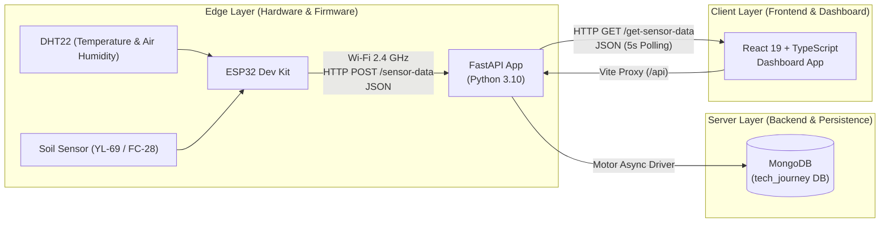
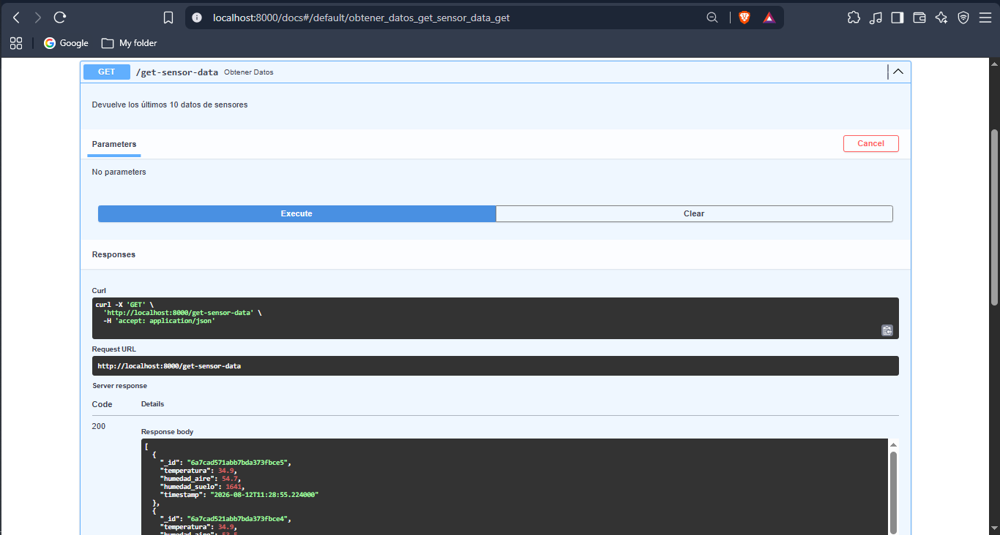

# GeoEnergy Environmental Monitor

**Full-stack IoT MVP for environmental telemetry applied to renewable energy scenarios and geothermal contexts.**

> **Project status note:** This repository represents a functional **MVP / Proof of Concept (PoC)** designed to demonstrate the vertical integration of IoT technologies across Hardware, Firmware, Backend, and Frontend layers. It is not an industrial SCADA system, OT platform, or production-ready solution.

---

## 📋 Overview

**GeoEnergy Environmental Monitor** is an end-to-end environmental telemetry platform that acquires temperature, air humidity, and soil moisture readings through ESP32-based field sensors, transmits the readings over Wi-Fi to a FastAPI REST API, persists them in a MongoDB NoSQL database, and displays them through an interactive React and TypeScript dashboard with periodic telemetry updates.

It is designed as a technical portfolio demonstration for distributed monitoring and instrumentation concepts applicable to renewable energy and geothermal-resource environments.

---

## 📐 System Architecture

The following diagram illustrates the component architecture and data flow from the physical sensors at the Edge layer to the user interface:



---

## 🛠️ Technology Stack

### Firmware / Edge

- **Microcontroller:** ESP32 Dev Module
- **Language / Environment:** C++ / Arduino Framework
- **Sensors:** DHT22 (Temperature and Air Humidity), analog/digital soil moisture sensor
- **Key Libraries:** `WiFi.h`, `HTTPClient.h`, `ArduinoJson`, `Adafruit_Sensor`, `DHT`

### Backend

- **Language:** Python 3.10+
- **Web Framework:** FastAPI `0.115.8`
- **Validation / Schemas:** Pydantic `2.10.6` / Pydantic Settings `2.7.1`
- **Async Database Driver:** Motor `3.7.0` (PyMongo `4.11.1`)
- **ASGI Server:** Uvicorn `0.34.0`
- **Database:** Local MongoDB (`localhost:27017`)

### Frontend

- **UI Framework:** React `19.0.0`
- **Language:** TypeScript `5.7.2`
- **Build Tool:** Vite `6.1.0`
- **Components & Styling:** Material UI (MUI `6.4.4`) / Emotion
- **Charts:** Recharts `2.15.1`
- **Animations & PWA:** Framer Motion `12.4.2` / Vite PWA `1.0.2`
- **HTTP Client:** Axios `1.7.9`

---

## 🔌 Hardware and Pinout

The physical integration between the sensors and the ESP32 microcontroller uses the following GPIO assignments:

| Sensor / Peripheral | Sensor Pin | ESP32 GPIO Pin | Input Mode | Reading Type |
| :--- | :--- | :--- | :--- | :--- |
| **DHT22** | DATA | `GPIO 4` | Digital Input | Temperature (°C) and Air Humidity (%) |
| **Soil Moisture Sensor** | AO (Analog Out) | `GPIO 34` | Analog Input (ADC1_CH6) | Raw ADC reading (0 - 4095) |
| **Soil Moisture Sensor** | DO (Digital Out) | `GPIO 27` | Digital Input | Binary flag (HIGH = Dry, LOW = Wet) |

> **Soil reading clarification:** In the current MVP, the `humedad_suelo` value is transmitted and displayed as a raw ADC reading from 0 to 4095 and is not calibrated to a volumetric moisture percentage.

---

## 🔄 End-to-End Data Contract

### 1. Ingestion Payload (ESP32 ➔ Backend)

Endpoint: `POST /sensor-data`  
Sampling interval: Every 5000 ms (5 seconds).

```json
{
  "temperatura": 25.4,
  "humedad_aire": 62.1,
  "humedad_suelo": 2150,
  "suelo_seco": 0
}
```

*Current schema note:* The firmware transmits the `suelo_seco` parameter (0 or 1). However, in the current backend Pydantic model (`SensorData`), this field is ignored and is not persisted in the database.

### 2. Telemetry Query (Frontend ➔ Backend)

Endpoint: `GET /get-sensor-data`  
Response: The latest 10 records ordered by `_id` in descending order.

```json
[
  {
    "_id": "67aa92...",
    "temperatura": 25.4,
    "humedad_aire": 62.1,
    "humedad_suelo": 2150,
    "timestamp": "2026-08-09T18:30:00.000Z"
  }
]
```

---

## 🔑 Security and Secrets Configuration

To prevent Wi-Fi credentials or private IP addresses from being exposed in the repository, firmware configuration is decoupled through local header files that are ignored by Git.

1. **Public template:** `firmware/geoenergy_monitor/secrets.example.h`  
   Versioned in the repository with placeholder values.

2. **Private file:** `firmware/geoenergy_monitor/secrets.h`  
   Explicitly excluded through `.gitignore`.

### Local Configuration Steps

1. Copy the template to its local version:

   ```bash
   cp firmware/geoenergy_monitor/secrets.example.h firmware/geoenergy_monitor/secrets.h
   ```

2. Populate the constants in `secrets.h` with the local credentials:

   ```cpp
   #pragma once

   #define WIFI_SSID "YOUR_WIFI_2.4GHZ"
   #define WIFI_PASSWORD "YOUR_PASSWORD"
   #define SERVER_URL "http://YOUR_LOCAL_IP:8000/sensor-data"
   ```

---

## 🚀 Local Setup and Execution Guide

### 1. Prerequisites

- Python 3.10 or later.
- Node.js 18 or later and npm.
- A running local MongoDB instance (`mongodb://localhost:27017`).
- Arduino IDE with the ESP32 board package installed.

---

### 2. Backend Setup and Startup

From the `backend/` directory:

```bash
# 1. Navigate to the directory
cd backend

# 2. Create and activate a virtual environment
python -m venv .venv

# On Windows (PowerShell):
.venv\Scripts\Activate.ps1

# On Linux/macOS:
source .venv/bin/activate

# 3. Install dependencies
pip install -r requirements.txt

# 4. Start the Uvicorn server
uvicorn app.main:app --host 0.0.0.0 --port 8000 --reload
```

- The API will be available at `http://localhost:8000`.
- Interactive API documentation (Swagger UI) is available at `http://localhost:8000/docs`.

---

### 3. Frontend Setup and Startup

From the `frontend/` directory:

```bash
# 1. Navigate to the directory
cd frontend

# 2. Install locked dependencies
npm ci

# 3. Start the Vite development server
npm run dev
```

- The web dashboard will open at `http://localhost:5173`.
- The Vite development server is configured with a proxy in `vite.config.ts` that forwards `/api/*` requests to `http://localhost:8000/*`.

---

### 4. Firmware Build and Upload (ESP32)

1. Open the `firmware/geoenergy_monitor` directory in **Arduino IDE**.
2. Create and configure `secrets.h` with the Wi-Fi credentials and the LAN IP address of the machine running the FastAPI backend.
3. Select the **ESP32 Dev Module** board and the corresponding COM port.
4. Compile and upload the sketch.
5. Open the Serial Monitor at **115200 baud** to verify the Wi-Fi connection and HTTP `200` responses from the server.

---

## ✅ MVP Status and Functional Evidence

The integration chain has been validated end-to-end, demonstrating:

- [x] Temperature and air humidity acquisition from the DHT22 sensor.
- [x] Analog soil moisture acquisition from the soil sensor.
- [x] Automatic ESP32 connection to a 2.4 GHz Wi-Fi network.
- [x] JSON payload construction and transmission through HTTP POST.
- [x] FastAPI processing and HTTP `200 OK` responses.
- [x] Asynchronous persistence of telemetry readings in MongoDB.
- [x] Automatic React dashboard updates through polling every 5 seconds.
- [x] Rendering of current values and historical charts with Recharts.

### 🔌 Physical Evidence — IoT Acquisition Node

Physical prototype used to acquire environmental variables for the MVP. The setup integrates an ESP32 Dev Module, a DHT22 sensor for air temperature and humidity, and a soil moisture sensor providing an analog reading.

The soil probe is shown applied directly to a physical soil sample while the ESP32 remains powered as the Edge node of the system.


**Demonstrated physical chain:** environmental sensors → ESP32 → data acquisition → telemetry transmission to the software platform.

### 🔗 API Evidence — FastAPI / Persisted Telemetry

The FastAPI layer exposes recent telemetry history through `GET /get-sensor-data`. The evidence shows an HTTP `200 OK` response and a JSON payload containing persisted temperature, air humidity, raw soil ADC readings, and timestamps.



**Demonstrated contract:** MongoDB → FastAPI `GET /get-sensor-data` → HTTP `200 OK` → JSON payload consumable by the frontend.

### 📸 Visual Evidence — Telemetry Dashboard

The dashboard shows the MVP running with periodic updates for temperature, air humidity, and analog soil moisture readings.

The visualization uses independent scales to preserve direct interpretation of environmental variables (`°C` / `%`) and the raw instrumental soil-sensor signal (`ADC RAW`).


**Demonstrated flow:** ESP32 → Wi-Fi / HTTP → FastAPI → MongoDB → React / TypeScript → multiscale telemetry history.

---

## ⚠️ Known MVP Limitations

1. **Raw Soil Reading:** Soil moisture is displayed as a raw ADC value (0-4095), not as a calibrated percentage.
2. **Model Schema:** The backend currently discards the `suelo_seco` field transmitted by the microcontroller.
3. **Historical Ordering:** The API returns the latest 10 records in descending order, so the client must reorder them to display history chronologically.
4. **Local Development Environment:** CORS is permissive (`allow_origins=["*"]`) and the endpoints currently have no authentication.

---

## 🔮 Roadmap / Future Work

- [ ] Calibrate the analog soil sensor to map raw ADC readings to a relative soil-moisture percentage.
- [ ] Add the `suelo_seco` field to the backend Pydantic model.
- [ ] Implement automatic chronological ordering for historical telemetry queries.
- [ ] Manage environment variables through `.env` files in both backend and frontend.
- [ ] Implement MQTT as a lightweight alternative to HTTP REST for continuous telemetry.
- [ ] Migrate the firmware project to **PlatformIO** for a more auditable build environment.
- [ ] Integrate threshold-based alerts for geothermal scenarios, such as overheating or thermal soil drying.

---

## 🌿 Application Context: Renewable Energy and Geothermal Systems

This project establishes a conceptual foundation for low-cost distributed telemetry in energy and environmental applications, including soil thermal-impact monitoring in geothermal exploration areas, weather stations for solar plants, and environmental monitoring in agricultural and industrial microclimates.

---

## 📁 Repository Structure

```text
.
├── firmware/
│   └── geoenergy_monitor/
│       ├── geoenergy_monitor.ino
│       ├── secrets.example.h
│       └── secrets.h (local, gitignored)
├── backend/
│   ├── app/
│   │   ├── models/
│   │   ├── routers/
│   │   ├── services/
│   │   ├── utils/
│   │   ├── config.py
│   │   ├── database.py
│   │   └── main.py
│   ├── requirements.txt
│   └── README.md
├── frontend/
│   ├── public/
│   ├── src/
│   │   ├── assets/
│   │   ├── context/
│   │   ├── App.css
│   │   ├── App.tsx
│   │   ├── index.css
│   │   └── main.tsx
│   ├── package.json
│   ├── package-lock.json
│   ├── vite.config.ts
│   └── README.md
├── .gitignore
└── README.md
```

---

## 👤 Author

**Richard Milian Rivas**  
Portfolio project focused on IoT, full-stack software engineering, instrumentation, and technologies applicable to the energy sector.
